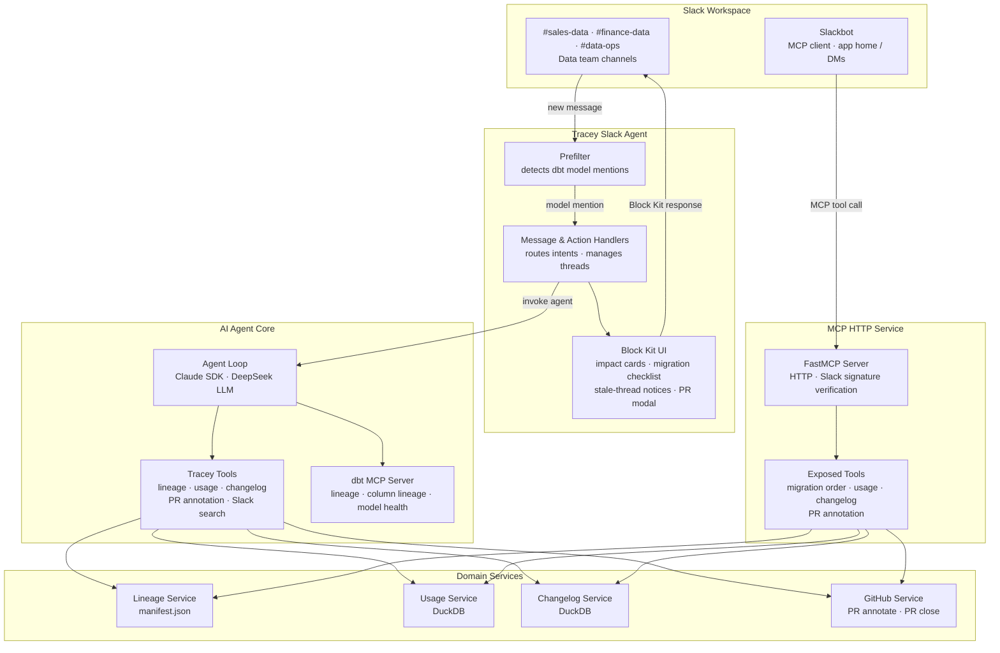

<p align="center"></p>

# Tracey

A Slack agent that detects dbt model changes in data team channels, runs automated impact analysis, and surfaces what a full lineage graph, what would break, who needs to be looped-in for cross-team alignment using Slack RTS.

[](https://python.org)
[](https://slack.dev/bolt-python/)
[](https://github.com/jlowin/fastmcp)
[](https://www.getdbt.com)

---

## What it does

- **Detects change proposals** actively monitors configured channels — no `@mention` needed
- **Traces downstream impact** using dbt lineage, column-level tracing, usage stats, and test health
- **Finds stale discussions** via Slack's Real-Time Search API and ranks domain experts from past threads
- **Generates migration plans** with topologically sorted checklists and Mermaid diagrams using Excalidraw MCP
- **Integrates with GitHub** to annotate PRs with impact summaries and labels, or close them directly from Slack
- **Exposes tools via MCP** so Slackbot itself can call Tracey for private, exploratory analysis

---

## Architecture



---

## Quick start

```bash
make setup         # uv sync --extra dev
make seed-data     # populate DuckDB with demo data
make dbt-run       # compile dbt models, run tests
make run-dev       # start unified dev server (MCP + Slack agent on one port)
make test
```

You'll need a [Slack app](manifest.json), an [LLM API key](https://api-docs.deepseek.com), and one [ngrok](https://ngrok.com/) tunnel pointed at your dev port. Set `TRACEY_SKIP_SIGNATURE_CHECK=1` for local development.

---

## Populating a demo Slack workspace

```bash
make seed-slack    # posts threaded conversations to your Slack sandbox
```

This creates 4 channels (`#sales-data`, `#finance-data`, `#product-data`, `#data-ops`), 6 distinct personas, and 7 threaded conversations across two time-batches — older threads appear stale, recent ones trigger fresh analysis. The DuckDB changelog is gated between batches so Tracey can exercise its full stale-thread detection pipeline.

**Limitations of the seeded data:** All messages use a single bot token with `chat:write.customize` for display names and avatars. The personas are cosmetic — every seeded message shares the same `author_user_id`. Real-Time Search will find the threads, but expert ranking will point to Tracey itself rather than real users. This is sufficient for demo evaluation; in production, real user conversations produce meaningful rankings through Slack's RTS API.

---

## Deployment (Railway)

Two services both expose `GET /health`. `railpack.json` configures the build (`pip install uv && uv sync`); `railway.json` provides health checks and restart policy.

After deployment, update your Slack app's Event Subscriptions and Interactivity Request URLs to point at the `slack-agent` service, and configure the Slackbot MCP Client to point at the `mcp` service's `/mcp` endpoint.

### Environment variables

```
DEEPSEEK_API_KEY=          # DeepSeek API key (or your LLM provider API)
SLACK_BOT_TOKEN=xoxb-...   # Slack bot token
SLACK_USER_TOKEN=xoxp-...  # Slack user token (for RTS)
SLACK_SIGNING_SECRET=...   # Slack app signing secret
SLACK_TARGET_CHANNEL_IDS=  # Comma-separated channel IDs (or blank for all)
GITHUB_TOKEN=ghp_...       # GitHub PAT
GITHUB_REPO=               # e.g. aybbr/slack-agent-builder-challenge
PORT=8000                   # Overridden by FASTMCP_PORT / SLACK_AGENT_PORT
```
---

## License

MIT
